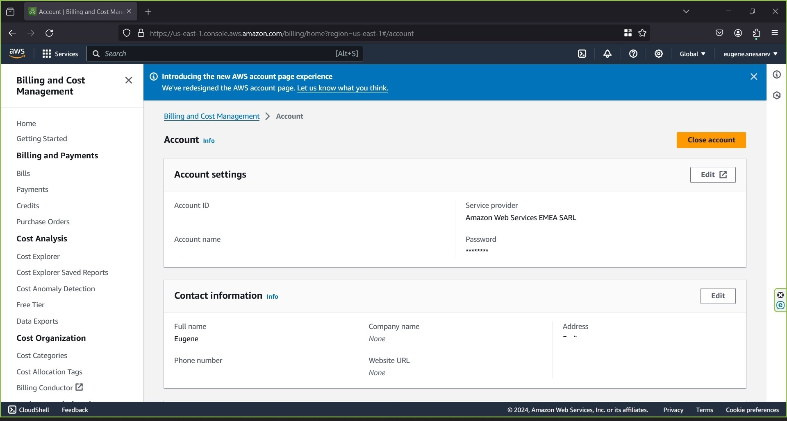

# Simple static website deployment guide  using  AWS S3  and GitHub Actions

It’s a fork of the https://github.com/nneyen/simplesite
Goal of this deployment is a demonstration of deployment simple static site using AWS S3 and GitHub Actions.
All actions were performed in accordance to this article

https://medium.com/@nneyenu/automation-how-to-deploy-your-static-website-to-s3-using-github-actions-642267301359 

### 1. Register free AWS Account



### 2. Register GitHub Account


### 3. Create S3 Bucket eusrepo-simplewebapp to deploy static website files


### 4. Grant permission for public users via policy


### 5.In order to provide access for GitHub Actions to perform update in S3 Bucket – creating the user with developer  name


### 6. Enable programmatic access to AWS CLI in order to make possible integration GitHub Actions with AWS and generate access key and secret


### 7. Grant AmazonS3FullAccess rights to user developer


### 8. Set up access key and secret key for site repository in GitHub


### 9. Add workflow in order to automatically deploy changes to S3 bucket

``` python
name: Upload Website

on:
  push:
    branches:
    - main

jobs:
  deploy-site:
    runs-on: ubuntu-latest
    steps:
      - uses: actions/checkout@v2
      - uses: jakejarvis/s3-sync-action@master
        with:
          args: --delete
        env:
          AWS_S3_BUCKET: eusrepo-simplewebapp
          AWS_ACCESS_KEY_ID: ${{ secrets.ACCESS_KEY }}
          AWS_SECRET_ACCESS_KEY: ${{ secrets.SECRET_KEY }}
          SOURCE_DIR: ./main

```

- workflow consists of the job deploy-site
- job uses actions actions/checkout@v4 (grant access to repository), jakejarvis/s3-sync-action (syncs source directory with S3 bucket using AWS CLI)
- AWS_S3_BUCKET,  AWS_ACCESS_KEY_ID,  AWS_SECRET_ACCESS_KEY SOURCE_DIR variables contain all necessary values to get access to S3 bucket

### 10. Demo page available by link https://eusrepo-simplewebapp.s3.amazonaws.com/index.html

